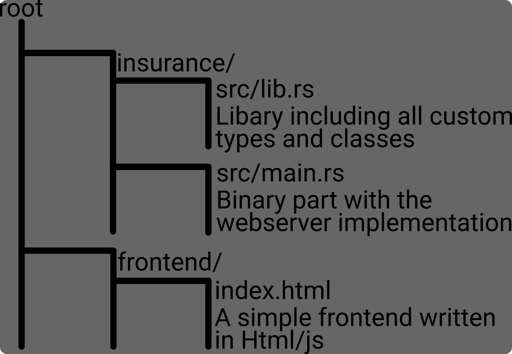

# CC_02

CC_02 is a little project I created during my practicum at Concordia Versicherungen. This Company is a private insurance provider with a big it section. In my time there I got the chance to do my own coding project. For this I chose to make a SQlite Database for storing insurance contracts. This database is accessible by a web-interface in vanila-js hosted by a webserver called "Rocket" written in Rust. Also the backend with the handeling of the contracts is written in Rust.

You can view the projects plans in Notes.md


## Overview



## Setup

```sh
cd insurance/
cargo run
```

Go to webbrowser and type in http://127.0.0.1/entry


